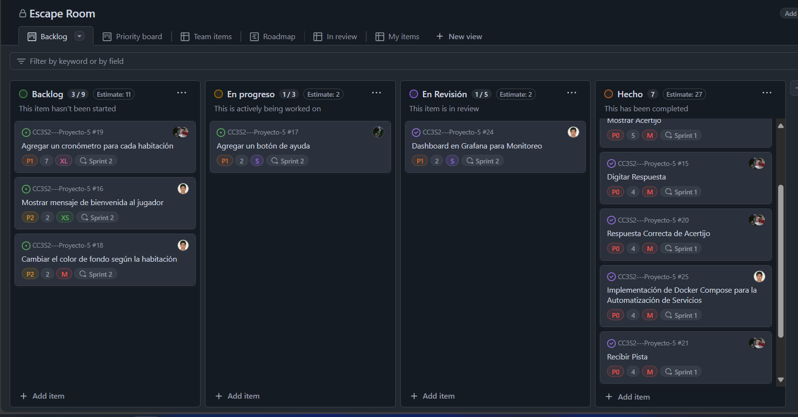
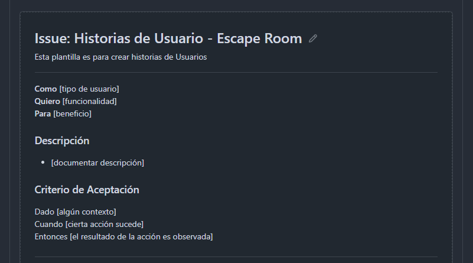
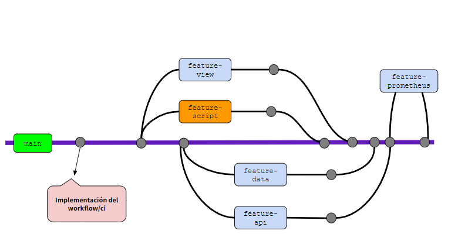
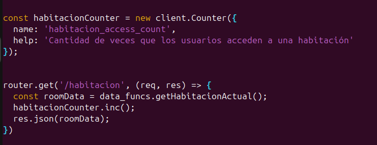
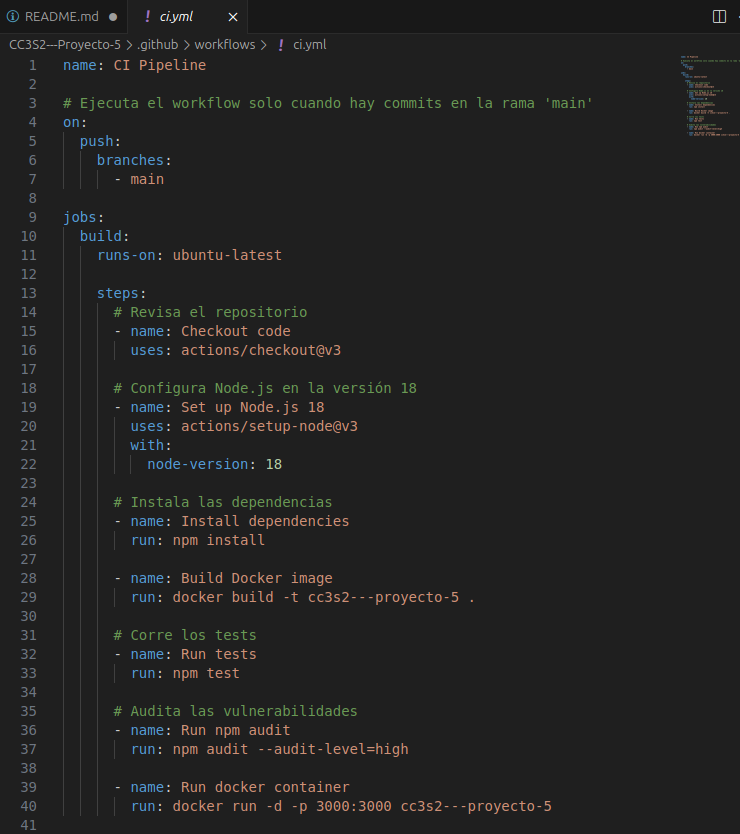
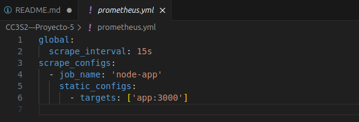
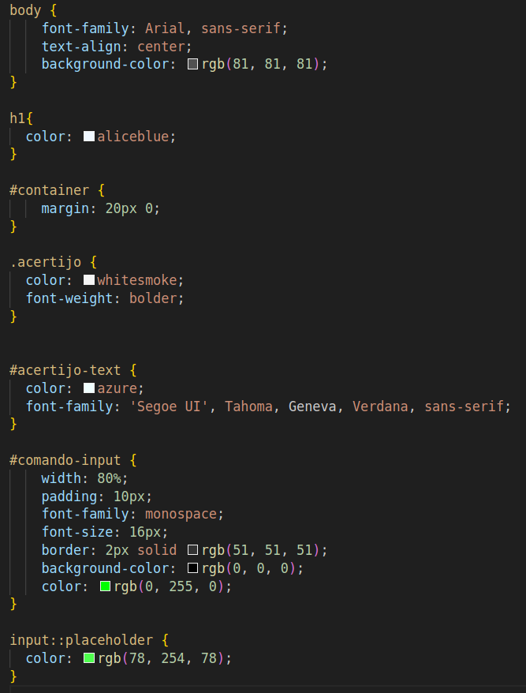
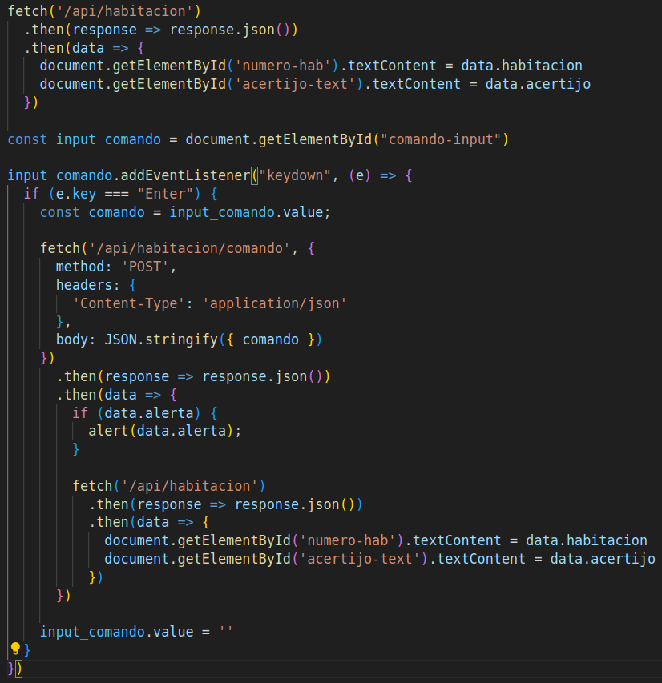
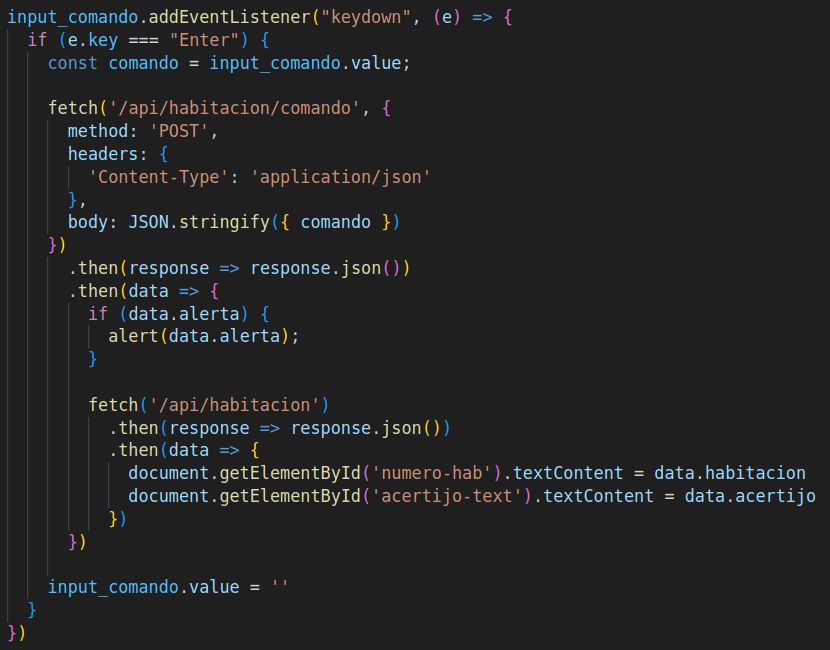

# PC2 - INFORME  
## Github, Scrum (Parte 1):  
Se creo un tablero kanban con el nombre de Escape - Room:  
  

  
Además se creo una plantillas de issues en GitHub para estandarizar la creación de historias de usuario, descripción y criterios de aceptación, la plantilla tiene la siguiente estructura:  
  
  
  
Se hizo la definición de las historias de usuario del proyecto, y se les calificó en base a tu prioridad, tamaño (complejidad: XS,S,M,L,XL) y el estimado (valor numérico), la siguiente tabla muestra los detalles: 

| Nombre del HU                       | Descripción del HU | Prioridad | Tamaño | Esfuerzo Estimado | Estado | Encargado |
| :---------------------------------: | :----------------: | :-------: | :----: | :---------------: | :----: | :-------: |  
|           Mostrar Acertijo          | Como jugador Quiero ver el acertijo de la habitación actual Para poder resolverlo | P0 | M | 5 | Hecho | Silva y Ravichagua |
|           Digitar Respuesta         | Como jugador Quiero digitar mi respuesta Para verificar si es correcta | P0 | M | 4 | Hecho | Silva y Ravichagua |
|    Respuesta Correcta de Acertijo   | Como jugador Quiero recibir una respuesta al acertar y avanzar a la siguiente habitación Para seguir progresando en el juego | P0 | M | 4 | Hecho | Silva y Ravichagua | 
|            Recibir Pista            | Como jugador Quiero recibir una pista cuando la solicite Para resolver el acertijo | P0 | M | 4 | Hecho | Quispe y Ravichagua |
| Notificacion a Respuesta Incorrecta | Como jugador Quiero recibir un mensaje de error cuando mi respuesta es incorrecta Para saber que debo intentarlo nuevamente | P0 | M | 3 | Hecho | Ravichagua |
|       Agregar un botón de ayuda     | Como jugador Quiero tener acceso a un botón que explique qué comandos puedo usar Para saber cómo interactuar correctamente con el juego | P1 | S | 2 | En proceso | Ravichagua |
|          Agregar cronómetro         | Como jugador Quiero tener un límite de tiempo para resolver cada acertijo Para que el juego sea más desafiante | P1 | XL | 7 | En proceso | Silva y Ravichagua |
|   Mensaje de bienvenida al jugador  | Como jugador Quiero ver una mensaje de bienvenida al iniciar el juego Para sentirme recibido y saber que el juego ha comenzado correctamente | P2 | XS | 2 | En proceso | Quispe |
|      Cambiar el color de fondo      | Como jugador Quiero que el color de fondo cambie cada vez que entro en una nueva habitación Para hacer más visual y distintiva cada habitación en el juego | P2 | M | 2 | En proceso | Quispe |  
  
#### Planificación y organización de Sprints  
Se decidió que el Proyecto se ha dividio en 3 sprints:  
## *Sprint 1*:  
1. Mostrar Acertijo  
2. Digitar Respuesta.
3. Respuesta Correcta de Acertijo.
4. Recibir Pista.
5. Notificacion a Respuesta Incorrecta. 
6. Implementación de Docker-compose. 
7. Configuración y Exposición de Métricas.  

Feedback:
- Desarrollamos la primera parte del proyecto, simple y sencillo para la visualizacion del jugador pero sin conocimiento de comandos a ejecutar por parte del jugador, como que escribir cuando requiere una ayuda.
- Visualizacion monocromatico para todas las habitaciones.
- No hay limite de tiempo para cada acertijo.
- Logica ambigua para volver a escribir la respuesta correcta luego de un intento erroneo.
- Mejora en la comunicacion cliente-servidor, y monitoreo con Grafana y Prometheus.

## *Sprint 2*:  
1. Dashboard en Grafana para Monitoreo.
2. Agregar un botón de ayuda.  
3. Agregar un cronómetro para cada habitación.
4. Mostrar mensaje de bienvenida al jugador.
5. Cambiar el color de fondo según la habitación.  
  
## *Sprint 3*:  
1. Refactorización de Código  
2. Despliegue en la nube usando netlify

  
  

# PC1- INFORME
# Informe acerca de el trabajo realizado
Vamos a desarrollar un juego de "Esacape ROOM" donde los jugadores deben resolver una serie de acertijos para escapar de un habitación virtual
El juego consiste en habitaciones secuenciales, donde vamos a ir agregando paso a paso cada funcionalidad  
  
# Division de Responsabilidades
**Manuel Ravichagua**: Encargado de crear las vistas y el script para el consumo de las apis.  
  
Ramas usadas:  
- **feature-view**: Se implementa la interfaz en html y css para que el juagdor pueda digitar los comandos e interactuar con el juego.  
  
- **feature-script**: Se implementa un script.js que sirve consumir las apis que brinda información como el número de habitación en que está el jugador y el acertijo, además de hacer un request a la api enviandole el comando digitado por el jugador para que la api lo procese.  
  
**Juan Silva**: Encargado del backend y construccion de la api.  
  
Ramas usadas:  
- **feature-data**: rama que crea un objeto donde están todos los acertijos y pistas además de funciones que interactuan con esos datos.  
  
- **feature-api**: rama que crea las apis con dos endpoints encargados de responder a las solicitudes del frontend.  
  
**Diego Quispe**: Encargado de la infraestructura.  

Ramas usadas 
- **main**: Se implenta el workflow (archivo yml) para el CI/CD, junto con los archivos de dockerfile, promethues y grafana.

- **feature-prometheus**: Se implementa una nueva funcionalidad la cual ayuda a monitorizar la cantidad de veces que la persona ingresa a las habitaciones.
  
  
  
    
# Flujo de trabajo  
Se hizo el desarrollo basado en troncales:   

  
# Cómo iniciar la app:
Para poder iniciar la aplicación debemos clonar el repositorio de nuestra aplicación para esto haremos el siguiente paso

`git clone https://github.com/JuanSilva2000/CC3S2---Proyecto-5.git`

Luego en la carpeta del proyecto vamos abrir la terminal y lanzamos todos los contenedores con el siguiente comando

`docker-compose up --build`

Finalmente vamos a dirigirnos a nuestro navegador para poder correr nuestra aplicacion

`http://localhost:3000`
  
      
## Lista de Preguntas:  
## 1. Resolución de acertijos mediante la API REST 
En el archivo app configuramos los middleware, y lanzamos la app en el puerto 3000, además montamos un conjunto de rutas bajo el prefijo api (ver linea 11 de la imágen):  
  
  
Aquí está la api, tiene dos endpoints:  
1. endpoint: `/habitacion`: Sirve para obtener la habitación en que se encuentra el jugador y el acertijo respectivo, y lo mandamos como JSON para que le frontend lo consuma, es decir lo muestre en el DOM (en el navegador)  
  
2. endpoint: `/habitacion/comando`:  este enpoint procesa el comando que el usuario digite por consola desde el frotend, y dependiendo del comando que digite se enviará una repsuesta con un mensaje.
  
  
Hemos visto que se uso ciertas funciones como `getHabitacionActual()`  
En data.js tenemos un objeto donde almacena cada habitación y su respectivo acertijo, entonces esta función retorna un objeto con la habitación y acertijo actual que se encuentra el jugador.
    
  
El 2do endpoint usa la función `procesarComando()` lo que hace es tomar el comando como parametro dependiendo de eso envía un mensaje para que en el frontend lo muestere como alert.  

  

## 2. Monitorización del desempeño de los jugadores

Para este caso nos hemos apoyado de prometheus y de grafana para poder monitorear, todos estos cambios se hicieron en la rama feature-prometheus el cual se hizo para poder desarrollar esta nueva funcionalidad para luego hacer un main en la principal. La métrica que implementamos es cuantas veces ingresamos a la habitación, para esto se procedio a cambiar las siguientes clases

routes.js

 

 app.js

  

 y el prometheus.yml el cual va a recoger estar métricas mediante el endpoint establecido

 


Luego al volver a correr nuestro contenedor podemos observar que las métrica se estan recogiendo de manera éxitosa


## 3. Dockerización del juego de escape room  
Para la parte de docker, creamos un dockerfile de tal forma que se pueda construir la imagen
  
  
Además se creo un docker-compose para la creacion de 3 contenedores de manera automática, una para la app, prometheus y para grafana
  
  
Nosotros no usamos una base de datos en si, en un modulo data creamos un `data.js` donde está cada habitación con sus respectivos acertijos y respuestas y pistas  

  
  

  
## 4. Pistas dinámicas en el juego  
Para el manejo de las pistas creamos una funcion de `procesarcomando()`, esta funcion tiene acceso a el archivo data.js para devolver las pistas


`procesarComando()` el comando que digite el usuario sera pasado como parámetro y se le dará una respuesta respectiva, los comandos válidos son `ver pista` , entonces devuelve un objeto con la pista para que el frontend lo muestre en un alert, la misma lógica aplica para otros comandos ya sea para la respuesta correcta u otro comando   

  
  
    

# Infraestructura

## 1: Implementación `ci.yml`


El archivo `ci.yml` configura el pipeline de integración continua (CI) para el proyecto. Este pipeline se ejecuta automáticamente cada vez que hay un commit en la rama `main`. Está diseñado para correr en una máquina virtual Ubuntu mediante GitHub Actions y realizar una serie de pasos automatizados.

### Explicación:
- **Configuración del evento**: El pipeline se activa con el evento `push` en la rama `main`, asegurando que solo los cambios en esta rama desencadenen la integración continua.
- **Configuración de Node.js**: El entorno se configura para usar la versión 18 de Node.js, lo cual es crucial para garantizar la compatibilidad del código con una versión específica del entorno de ejecución.
- **Instalación de dependencias**: El paso `npm install` se encarga de instalar todas las dependencias definidas en el archivo `package.json`, asegurando que el entorno del pipeline tenga todos los módulos necesarios.
- **Construcción de la imagen Docker**: El pipeline luego construye una imagen Docker basada en el `Dockerfile` presente en el proyecto. Esto garantiza que la aplicación se pueda ejecutar de forma consistente en diferentes entornos.
- **Ejecución de tests**: El paso `npm test` asegura que todos los tests definidos se ejecuten, validando que la aplicación esté funcionando correctamente.
- **Auditoría de seguridad**: `npm audit` revisa las vulnerabilidades en las dependencias, asegurando que el proyecto esté protegido contra posibles riesgos de seguridad.
- **Despliegue del contenedor Docker**: Finalmente, se levanta un contenedor Docker con la aplicación escuchando en el puerto 3000.

## 2: Implementación `Dockerfile`


El `Dockerfile` define el entorno de Docker para el proyecto. Aquí se especifican las instrucciones necesarias para construir una imagen Docker que contenga la aplicación.

### Explicación:
- **Base de imagen**: La imagen base es `node:18`, que incluye Node.js en su versión 18. Esto asegura que la aplicación se ejecute en un entorno Node.js de última generación.
- **Directorio de trabajo**: El comando `WORKDIR /app` define el directorio dentro del contenedor donde se ubicará la aplicación.
- **Copia de dependencias**: Se copian los archivos `package*.json` al contenedor, y luego se ejecuta `npm install` para instalar las dependencias de la aplicación.
- **Copia del código fuente**: El comando `COPY . .` copia el código fuente completo desde el directorio del host al contenedor.
- **Exposición del puerto**: `EXPOSE 3000` asegura que el contenedor escuche en el puerto 3000, permitiendo que la aplicación sea accesible.
- **Comando de inicio**: Finalmente, se especifica que la aplicación debe iniciarse ejecutando `node src/app.js` cuando el contenedor esté en funcionamiento.

## 3: Implementación `docker-compose.yml`


El archivo `docker-compose.yml` se utiliza para orquestar múltiples servicios Docker en un entorno de contenedores, incluyendo la aplicación Node.js, Prometheus para monitoreo, y Grafana para visualización de métricas.

### Explicación:
- **Definición del servicio `app`**: Este servicio construye la imagen de la aplicación utilizando el `Dockerfile` y expone el puerto 3000 (o el que esté definido por la variable de entorno `APP_PORT`). Además, se define la variable de entorno `NODE_ENV` que puede configurarse como `production` o `development` dependiendo del entorno.
- **Servicio `prometheus`**: Prometheus es un sistema de monitoreo que recopila métricas de la aplicación. El volumen monta el archivo `prometheus.yml` desde el sistema de archivos del host para configurar las tareas de monitoreo. El puerto 9090 es expuesto para acceder a la interfaz web de Prometheus.
- **Servicio `grafana`**: Grafana es una herramienta de visualización de métricas que se ejecuta en el puerto 3000 (o 3100 si se usa la variable de entorno `GRAFANA_PORT`). Grafana permite crear paneles interactivos para visualizar los datos recolectados por Prometheus.

## 4: Implementación `prometheus.yml`


El archivo `prometheus.yml` define las configuraciones para que Prometheus pueda realizar scraping de métricas desde la aplicación Node.js.

### Explicación:
- **Intervalo global de scraping**: El valor `scrape_interval` se define en 15 segundos, lo que significa que Prometheus recopilará métricas cada 15 segundos.
- **Configuración de scraping para la aplicación Node.js**: Se define un job llamado `node-app` con un target estático que apunta a `app:3000`, es decir, el servicio de la aplicación en Docker, que expone sus métricas en el puerto 3000. Prometheus usará esta configuración para recolectar métricas y almacenarlas para visualización y análisis.

    

# FRONTEND
## 1: Módulo Public
Este archivo HTML contiene el prototipo de la página principal de nuestro juego dado una plantilla generica de un simple juego de preguntas, seguido de dos directorios almacenando un archivo css y un script.


Se puede ver la logica de como adquirimos la respuesta a la pregunta realizada para el usuario y guardandolo en un objeto `comando-input`.


Asimismo la actualizacion del Frontend, de manera como realiza correcta o incorrectamente las respuestas del jugador, tal objeto que nos señala `numero-hab`.


## 2: Submódulo CSS
Aqui obtenemos el diseño del Frontend para una mayor visualizacion e interaccion con el jugador.


No hay mucho que comentar de una plantilla de diseño donde es subjetivo.

## 3: Submódulo JS
Aqui implementamos un codigo en JavaScript que interactua con la API para actualizar nuestra pagina web del juego.


Utilizamos la funcion `fetch` para hacer solicitudes a un servidor y manejar respuestas, como `fecth('api/habitacion')` hace una solicitud GET para obtener de la API la informacion de la habitacion actual y el acertijo, asi la funcion resuelve la `Promise` convierte la respuesta en formato JSON.


Capturamos la respuesta introducida por el jugador dado la siguiente linea.  
`const input_comando = document.getElementById("comando-input");`  

Añadimos un `listener` para el evento de `keydown` de la respuesta antes guardada, asi cada vez que una tecla (en este caso `Enter`) sea presionada se ejecute la funcion propocionada.  

Realiza una solicitud POST a la URL dada, procesa la respuesta y suelta una alerta de exito o de fracaso. 
Tambien actualizamos como anteriormente mencionamos con un `fecth` mediante una solicitud GET para la nueva informacion del juego y finalmente limpiamos el campo de entrada.


## 4: Módulo Test
Para el testeo usaremos `jest` y una dependencia llamada `jest-fetch-mock`, utilizaremos un mock de fecth para que nos ayude a definir respuestas que nos devolvera la API al hacer una solicitud con el metodo `enableMocks()`.   
La instalación de esta dependecia se hace mendiante:  
```
    npm install jest-fetch-mock
```

El test es para ver si cuando se hace una solicitud a traves de `fecth()` dado el numero de habitacion y el correspodiente acertijo, devuelva mediante otro `fecth()` de una solicitud GET, devuelva el correcto numero de habitacion donde esta el jugador y el correspodiente acertijo de la habitacion.


# BACKEND  
  
## 1: Módulo Data  
No se usó niguna base de datos, en vez de eso, para almacenar las habitaciones con sus acertijos, respuesta y pista creamos un objeto en el script `data.js` que los contenia de la siguiente manera:  
  
  
Se va a poder interactuar con esos datos con dos funciones, estas están en el script `data_func.js`.   
  
Una de esas funciones se llama `getHabitacionActual()` que básicamente devuelve la tanto la habitación en que se encuentra el jugador y su acertijo respectivo.  

   
  
La otra función `procesarComando()` recibe como parámetro el comando digitado por el usuario desde el frontend y aqui procesamos una respuesta que devolverá la función en base al comando digitado:  
  
  
  
## 2. Módulo src  
Dependencias a tener en cuenta:   
-Usamos `express` para construir nuestra api.  
-Usamos `body-parser` que nos ayuda a procesar el cuerpo de las solicitudes entrantes que tienen formato Json.  
  
Todo eso lo instalamos con
```
npm install expree body-parser
```  
Y en el `package.json` en la sección de dependencies aparece dichas dependencias instaladas:  
```
     "dependencies": {
        "body-parser": "^1.20.3",
        "express": "^4.21.0",
     }
```    
  
El archivo app configuramos los middleware, y lo lanzamos en el puerto 3000, además montamos un conjunto de rutas bajo el prefijo api (ver linea 11 de la imágen):  
  
  
 
En el archivo `routes.js` es donde se definen los 2 endpoints que utilizarán las funciones definidas del modulo data (`data/data_func.js`) y enviar una respuesta al frontend para que las renderize en el dom y lo muestre al usuario.  
  
  
  
## 3. Módulo test  
Para los test usamos jest y una dependencia llamada `jest-fetch-mock`, como su nombre lo indica es un mock de fetch que nos ayudará a definir respuestas que debería devolver la api al hacer algun request utilizando el método `mockResponseOnce()`.  
La instalación de esta dependecia se hace mendiante:  
```
    npm install jest-fetch-mock
```
  
1. El primer test es para verificar que la api esta respondiendo al comando `ver pista`, por defecto se comienza en la habitación uno y la pista esperada es "Es una fruta", lo que se hace es verificar que la api devuelva eso  
  
  
   
2. El segundo test es para verificar que se muestra el mensaje de "Respuesta correcta" cuando se responde bien al acertijo, el fecth se hace con un método POST pues con este se envía datos al servidor (api), en este caso es el comando, como por defecto primero se tiene el primer acertijo entonces al responder con `pera` debería mostrarse el mensaje de respuesta correcta, y eso lo verifica el test:  
  


# JUGABILIDAD
## Juego - Interfaz
Veremos al iniciar el proyecto, tendremos la interfaz completa para poder jugar y recibir respuestas.
  

Con el respectivo numero de habitacion y para recibir la respuesta del acertijo propuesto. Podemos responder de diferentes maneras para poder ver la funcionalidad y la respuesta de nuestro juego.

### Respuesta Correcta
Veremos que saldra un resultado si respondemos de manera correta al acertijo, avanzaras a la siguiente habitacion con un acertijo nuevo y desafiante.


### Respuesta Incorrecta
Veremos que nos responde con el siguiente mensaje, limpia la consola para la nueva respuesta.


### Ver Pista
Implementamos un comodin para cada acertijo donde podras tener una descripcion no tan cercana a la respuesta.
Primero tendras que escribir `ver pista` para esta opcion.


### Fin del Juego
Finalmente, al responder correctamente todas las respuesta, obtendras un mensaje que has escapado exitosamente de las habitaciones.
